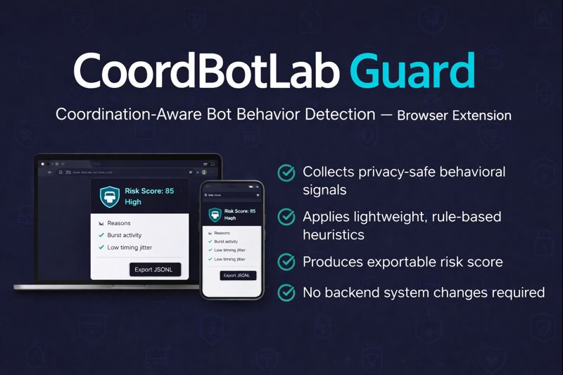

# CoordBotLab Guard  
**Coordination-Aware Bot Behavior Detection — Browser Extension**



> A real-world, privacy-preserving **browser extension** that operationalizes coordination-aware bot detection research by collecting lightweight behavioral signals and producing explainable risk indicators — **without building or modifying any web system**.

---

## 🔍 What is this project?

**CoordBotLab Guard** is a research-driven browser extension that demonstrates how **coordinated bot-like behavior** can be detected in practice using **client-side behavioral telemetry**.

Instead of relying on heavy machine-learning models in the browser or server-side identifiers (IP, fingerprinting), the extension:

- Collects **minimal interaction metadata** (click/scroll/keydown timing)
- Applies **rule-based, explainable heuristics** inspired by bot-detection literature
- Produces a **real-time risk score**
- Exports anonymized logs for **offline ML dataset creation**

This bridges the gap between **academic bot-detection research** and **real-world deployability**.

---

## 🎯 Why this matters

Most bot-detection research:
- uses synthetic or server-side data only
- assumes backend control
- ignores deployment and privacy constraints

This project shows that:
- realistic behavioral data can be collected **without backend changes**
- coordination signals can be observed **in real time**
- ML can be trained **offline**, not forced into the client

---

## ✨ Key Features

### Browser Extension (Real-World Artifact)
- Collects privacy-safe events:
  - `click`, `scroll`, `keydown`
  - timestamp + page path only
- Per-tab random session IDs (no cross-site tracking)
- Local, explainable **risk scoring**
- Popup UI with reasons
- **Export JSONL logs** for ML research

### Detection Signals (Rule-Based)
- High event rate (burst behavior)
- Low timing jitter (script-like consistency)
- Repeated short action sequences
- Multi-tab synchronization bursts

> ⚠️ The risk score is **heuristic**, not a final ML classification.

---

## 🧠 Research Architecture

Browser Extension
↓
Behavioral Events (JSONL)
↓
Feature Engineering (offline)
↓
ML Models (research phase)
↓
Coordinated Bot Detection

yaml
Copy code

The extension enables **real-world data collection**; machine learning is applied **offline** for accuracy, scalability, and privacy.

---

## 📁 Project Structure

```text
COORDBOTLAB/
├─ api/                     # Test API (lab environment)
├─ simulator/               # Traffic generator (research only)
├─ detector/                # Coordination detector (Python)
├─ evaluator/               # Evaluation scripts
├─ data/                    # Logs & alerts
├─ cordbotlab-extension/    # Browser extension (this project)
│  ├─ manifest.json
│  ├─ background.js
│  ├─ content.js
│  ├─ popup.html
│  ├─ popup.js
│  ├─ popup.css
│  └─ icons/
└─ requirements.txt
🚀 How to install (Chrome Desktop)
Open chrome://extensions

Enable Developer mode

Click Load unpacked

Select:

swift
Copy code
cordbotlab-extension/
Open any website and interact

Click the extension icon to view the risk score

📤 Exporting Data for ML
The extension can export anonymized interaction logs:

php-template
Copy code
cordbotlab_<session-id>.jsonl
These logs can be transformed into ML features such as:

inter-event timing statistics

sequence n-grams

burst entropy

coordination scores

📱 Mobile Notes
Mobile Chrome does not support desktop extensions.

On Android, extension-capable browsers (e.g., Kiwi) may be used for demonstration.

ML training and evaluation remain platform-independent.

🔐 Privacy & Ethics
No keystroke values captured

No page content collected

No persistent identifiers

User-controlled data export

This project is intended only for defensive research and education.

🎓 Academic Relevance
This extension supports research on:

Behavioral biometrics

Coordination-aware bot detection

Lightweight real-time defenses

Privacy-preserving security analytics

It complements a systematic literature review on coordinated bot detection in real-time web/mobile applications.

🧩 Future Work
ML feature extraction pipeline

Unsupervised coordination detection

Threshold sensitivity analysis

Cross-platform behavior modeling

👤 Author
Kavindu Peiris
Software Engineering Student
Research Focus: Coordinated Bot Detection, Real-Time Security, Behavioral Analysis
